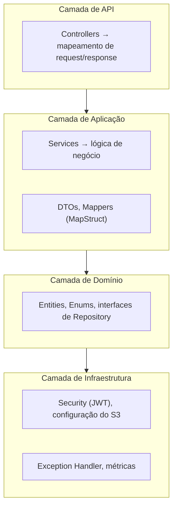
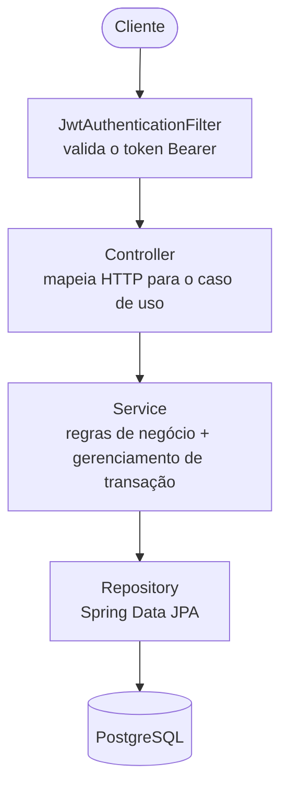
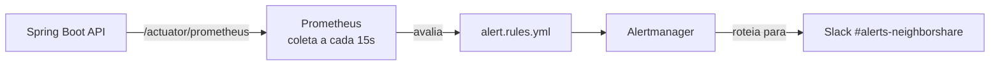
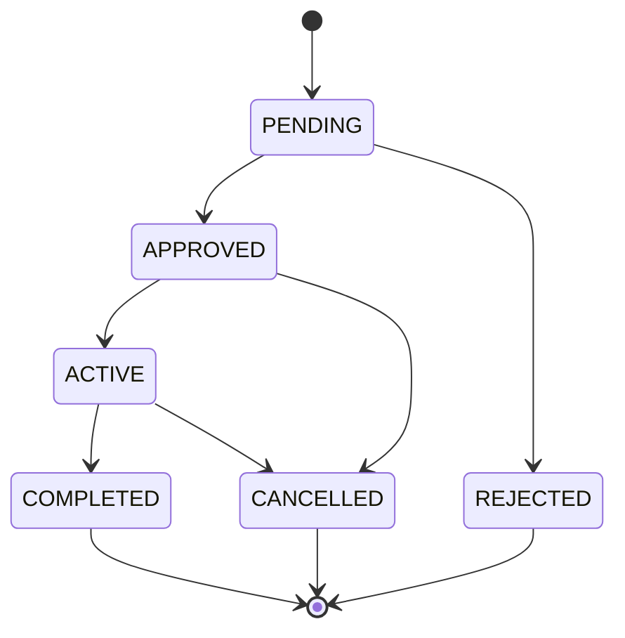

<div align="center">

# NeighborShare API

**Uma plataforma de economia circular local para vizinhos compartilharem itens dentro de comunidades de confiança.**


</div>

---

## Sumário

- [Sobre o Projeto](#sobre-o-projeto)
- [Funcionalidades](#funcionalidades)
- [Arquitetura](#arquitetura)
- [Stack Tecnológica](#stack-tecnológica)
- [Como Começar](#como-começar)
  - [Pré-requisitos](#pré-requisitos)
  - [Variáveis de Ambiente](#variáveis-de-ambiente)
  - [Executando Localmente](#executando-localmente)
- [Referência da API](#referência-da-api)
- [Segurança](#segurança)
- [Observabilidade](#observabilidade)
- [Estrutura do Projeto](#estrutura-do-projeto)
- [Roadmap](#roadmap)

---

## Sobre o Projeto

NeighborShare é um backend RESTful para uma **plataforma de economia circular local** que permite que vizinhos compartilhem ferramentas, eletrodomésticos e outros itens dentro de comunidades fechadas. Os usuários criam ou entram em comunidades por meio de códigos de convite, cadastram itens para empréstimo e gerenciam reservas — tudo em um ambiente seguro e observável.

O projeto foi construído com foco em **prontidão para produção**: arquitetura em camadas, autenticação JWT sem estado (*stateless*), reservas livres de conflito usando transações serializáveis, uploads pré-assinados (*presigned*) para o S3, respostas de erro estruturadas (RFC 7807) e uma stack completa de observabilidade com Prometheus e Alertmanager.

---

## Funcionalidades

- **Gestão de Comunidades** — Criação de comunidades com códigos de convite gerados automaticamente; entrada por código; promoção/remoção de membros; transferência de direitos de administrador.
- **Catálogo de Itens** — Cadastro de itens com classificação de condição, regras de empréstimo e fotos; filtro por status de disponibilidade.
- **Reservas Livres de Conflito** — Detecção de sobreposição com isolamento de transação `SERIALIZABLE` para evitar reservas duplicadas (*double-booking*) em requisições concorrentes.
- **Sistema de Reputação** — Usuários começam com nota `5.0`, que evolui através de avaliações pós-empréstimo.
- **Uploads Pré-assinados para o S3** — Os clientes enviam fotos diretamente para o S3/LocalStack; a API nunca manipula dados binários.
- **Exclusão Lógica (Soft Delete)** — Entidades nunca são removidas fisicamente; todas as queries usam `@SQLRestriction("deleted = false")`.
- **Erros Estruturados** — Todas as respostas de erro seguem o padrão [RFC 7807 Problem Detail](https://www.rfc-editor.org/rfc/rfc7807), incluindo mensagens de validação por campo.
- **Observabilidade** — Métricas HTTP com histogramas de percentil, métricas de negócio customizadas, regras de alerta no Prometheus e roteamento via Alertmanager com integração ao Slack.

---

## Arquitetura

O projeto segue uma **arquitetura em camadas** com clara separação de responsabilidades:



### Ciclo de Vida da Requisição



### Stack de Observabilidade



---

## Stack Tecnológica

| Categoria | Tecnologia |
|---|---|
| Linguagem | Java 21 |
| Framework | Spring Boot 3.3.5 |
| Segurança | Spring Security + JJWT 0.12.6 |
| Banco de Dados | PostgreSQL 16 |
| ORM | Spring Data JPA / Hibernate |
| Cache | Caffeine (em processo) |
| Mapeamento | MapStruct 1.5.5 |
| Armazenamento de Arquivos | AWS S3 SDK v2 (LocalStack em dev) |
| Documentação | SpringDoc OpenAPI 3 / Swagger UI |
| Monitoramento | Micrometer + Prometheus |
| Alertas | Alertmanager + Slack |
| Testes | JUnit 5, Testcontainers (PostgreSQL), H2 |
| Build | Maven 3 |

---

## Como Começar

### Pré-requisitos

| Ferramenta | Versão |
|---|---|
| Java | 21+ |
| Maven | 3.9+ |
| Docker | 24+ (para PostgreSQL e LocalStack) |
| PostgreSQL | 16 (ou via Docker) |

### Variáveis de Ambiente

A aplicação usa **três perfis do Spring** (`dev`, `test`, `prod`). O perfil ativo é controlado pela variável de ambiente `SPRING_PROFILES_ACTIVE`.

#### Perfil `dev` (padrão)

| Variável | Padrão | Descrição |
|---|---|---|
| `SPRING_PROFILES_ACTIVE` | `dev` | Perfil ativo do Spring |
| `DB_URL` | `jdbc:postgresql://localhost:5432/neighborshare_dev` | URL de conexão JDBC |
| `DB_USER` | `db_user` | Usuário do banco de dados |
| `DB_PASSWORD` | `db_password` | Senha do banco de dados |
| `JWT_SECRET` | *(padrão de dev — altere em produção)* | Segredo HMAC-SHA (mín. 32 caracteres) |
| `JWT_EXPIRATION` | `86400000` | TTL do access token em ms (24h) |
| `JWT_REFRESH_EXPIRATION` | `604800000` | TTL do refresh token em ms (7d) |
| `AWS_S3_BUCKET` | `neighborshare-items-bucket` | Nome do bucket S3 |
| `AWS_REGION` | `us-east-1` | Região da AWS |
| `AWS_ACCESS_KEY_ID` | `test` | Chave de acesso da AWS (LocalStack) |
| `AWS_SECRET_ACCESS_KEY` | `test` | Chave secreta da AWS (LocalStack) |
| `AWS_S3_ENDPOINT` | `http://localhost:4566` | Endpoint customizado do S3 (LocalStack) |

> **Produção (perfil `prod`):** Todas as variáveis são **obrigatórias** e não possuem valores padrão. O `ddl-auto` é definido como `validate` — mudanças de schema devem ser gerenciadas via migrations (ex.: Flyway/Liquibase).

### Executando Localmente

**1. Suba as dependências com Docker**

```bash
# PostgreSQL
docker run -d \
  --name neighborshare-postgres \
  -e POSTGRES_DB=neighborshare_dev \
  -e POSTGRES_USER=db_user \
  -e POSTGRES_PASSWORD=db_password \
  -p 5432:5432 \
  postgres:16-alpine

# LocalStack (emulação do S3)
docker run -d \
  --name neighborshare-localstack \
  -e SERVICES=s3 \
  -p 4566:4566 \
  localstack/localstack
```

**2. Crie o bucket S3 no LocalStack**

```bash
aws --endpoint-url=http://localhost:4566 s3 mb s3://neighborshare-items-bucket
```

**3. Compile e execute a aplicação**

```bash
# Clone o repositório
git clone https://github.com/alexanderbs3/neighborshare.git
cd neighborshare

# Build (sem rodar os testes)
./mvnw clean package -DskipTests

# Executa (o perfil dev é o padrão)
java -jar target/neighborshare-1.0.0.jar
```

**4. Verifique se a API está no ar**

```bash
curl http://localhost:8080/actuator/health
# {"status":"UP", ...}
```

**5. Acesse o Swagger UI**

```
http://localhost:8080/swagger-ui.html
```

#### Executando os testes

```bash
# Testes unitários + integração (usa H2 em memória, perfil test)
./mvnw test
```

> Os testes usam **Testcontainers** para os testes de integração com PostgreSQL e **H2** (modo PostgreSQL) para testes unitários mais leves. O Docker precisa estar em execução.

---

## Referência da API

Todos os endpoints, exceto `/api/v1/auth/**`, `/swagger-ui/**`, `/v3/api-docs/**`, `/actuator/health` e `/actuator/info`, exigem um token `Bearer` no cabeçalho `Authorization`.

### Autenticação

| Método | Endpoint | Descrição | Autenticação |
|---|---|---|---|
| `POST` | `/api/v1/auth/register` | Registra um novo usuário | Público |
| `POST` | `/api/v1/auth/login` | Autentica e recebe o JWT | Público |

**Corpo da requisição de registro:**
```json
{
  "name": "Alexander Brasiliano",
  "email": "alexander@example.com",
  "password": "senha123"
}
```

**Resposta de login / registro:**
```json
{
  "accessToken": "eyJhbGci...",
  "refreshToken": "eyJhbGci...",
  "expiresIn": 86400
}
```

---

### Comunidades

| Método | Endpoint | Descrição |
|---|---|---|
| `POST` | `/api/v1/communities` | Cria uma comunidade (quem chama vira `COMMUNITY_ADMIN`) |
| `POST` | `/api/v1/communities/join?inviteCode=` | Entra em uma comunidade usando o código de convite |
| `GET` | `/api/v1/communities/{communityId}` | Obtém os detalhes da comunidade |
| `GET` | `/api/v1/communities/my` | Lista minhas comunidades (paginável) |
| `DELETE` | `/api/v1/communities/{communityId}/leave` | Sai de uma comunidade |

**Corpo da requisição de criação de comunidade:**
```json
{
  "name": "Vizinhos do Pituba",
  "description": "Comunidade para compartilhar itens no bairro Pituba"
}
```

---

### Membros da Comunidade

> Esses endpoints exigem o papel `COMMUNITY_ADMIN` para ações de escrita/alteração.

| Método | Endpoint | Descrição |
|---|---|---|
| `GET` | `/api/v1/communities/{communityId}/members` | Lista os membros (paginável) |
| `PATCH` | `/api/v1/communities/{communityId}/members/{memberId}/role` | Atualiza o papel do membro |
| `DELETE` | `/api/v1/communities/{communityId}/members/{memberId}` | Remove um membro |

**Corpo da requisição de atualização de papel:**
```json
{
  "role": "COMMUNITY_ADMIN"
}
```

Papéis disponíveis: `COMMUNITY_ADMIN` | `MEMBER`

---

### Itens

| Método | Endpoint | Descrição |
|---|---|---|
| `POST` | `/api/v1/items` | Cadastra um novo item |
| `GET` | `/api/v1/items/community/{communityId}?status=AVAILABLE` | Lista os itens da comunidade por status (paginável) |

**Corpo da requisição de criação de item:**
```json
{
  "name": "Furadeira Bosch GSB 13",
  "category": "Ferramentas",
  "condition": "GOOD",
  "communityId": "{{communityId}}",
  "loanRules": "Devolver em até 3 dias.",
  "photoUrls": ["https://bucket.s3.amazonaws.com/key.jpg"]
}
```

**Condições do item:** `NEW` | `GOOD` | `FAIR`

**Status do item (filtro):** `AVAILABLE` | `RESERVED` | `BORROWED` | `UNAVAILABLE`

---

### Reservas e Avaliações

| Método | Endpoint | Descrição |
|---|---|---|
| `POST` | `/api/v1/reservations/reviews` | Envia uma avaliação para uma reserva concluída |

**Corpo da requisição de criação de avaliação:**
```json
{
  "reservationId": "{{reservationId}}",
  "rating": 5,
  "comment": "Item devolvido antes do prazo e em ótimas condições."
}
```

`rating` deve ser um número inteiro entre `1` e `5`.

**Ciclo de vida da reserva:**


<!-- Nota: a transição para CANCELLED foi assumida como possível a partir de APPROVED/ACTIVE
     (antes da conclusão do empréstimo). Ajuste conforme a regra real implementada em ReservationService. -->

---

### Mídia e Armazenamento

| Método | Endpoint | Descrição |
|---|---|---|
| `POST` | `/api/v1/media/presigned-url?filename=&contentType=` | Gera uma URL pré-assinada do S3 para upload (válida por 15 min) |

**Fluxo de upload:**
1. Chame esse endpoint para receber `uploadUrl` e `fileKey`.
2. Faça um `PUT` do binário do arquivo diretamente para `uploadUrl`, com o cabeçalho `Content-Type` correspondente.
3. Inclua `fileKey` (ou a URL pública) no array `photoUrls` ao criar um item.

---

### Respostas de Erro

Todos os erros seguem o padrão [RFC 7807 Problem Detail](https://www.rfc-editor.org/rfc/rfc7807):

```json
{
  "type": "https://neighborshare.com/errors/business-conflict",
  "title": "Regra de Negócio Violada",
  "status": 409,
  "detail": "Já existe uma reserva aprovada ou ativa para este período.",
  "timestamp": "2025-04-18T14:30:00Z"
}
```

| Status HTTP | Cenário |
|---|---|
| `400` | Erros de validação (inclui o mapa `invalidFields`) |
| `401` | JWT ausente ou inválido |
| `403` | Permissões insuficientes |
| `404` | Recurso não encontrado |
| `409` | Violação de regra de negócio (ex.: reserva duplicada, já é membro) |

---

## Segurança

- **Autenticação:** JWT sem estado (sem sessões no servidor). Os tokens são validados em toda requisição pelo `JwtAuthenticationFilter`.
- **Autorização:** `@EnableMethodSecurity` com `@PreAuthorize` na camada de service. O endpoint `/actuator/prometheus` exige `ROLE_ADMIN`.
- **Senhas:** Hash com BCrypt.
- **Tempo de vida do token:** Access token = **24h** · Refresh token = **7d** (configurável via variáveis de ambiente).
- **Exclusão Lógica:** Usuários excluídos ficam bloqueados via métodos do `UserDetails` que verificam a flag `deleted`.

---

## Observabilidade

### Endpoints do Actuator

| Endpoint | Acesso | Descrição |
|---|---|---|
| `GET /actuator/health` | Público | Probes de liveness e readiness |
| `GET /actuator/info` | Público | Informações da aplicação |
| `GET /actuator/prometheus` | `ROLE_ADMIN` | Coleta de métricas do Prometheus |

### Métricas do Prometheus

As métricas HTTP são exportadas com **histogramas de percentil** (P50, P95, P99) via Micrometer:

```yaml
metrics:
  distribution:
    percentiles-histogram:
      http.server.requests: true
```

**Métricas de negócio customizadas** definidas em `BusinessMetrics.java`:

| Métrica | Tipo | Descrição |
|---|---|---|
| `neighborshare_reservations_created_total` | Counter | Total de reservas solicitadas |
| `neighborshare_reservation_processing_time_seconds` | Timer | Duração da lógica de negócio da reserva |

### Regras de Alerta (`alert.rules.yml`)

| Alerta | Condição | Severidade |
|---|---|---|
| `NeighborShareApiDown` | Instância inacessível por mais de 1 min | 🔴 Crítico |
| `HighHttp5xxRate` | Taxa de erros 5xx > 5% por 2 min | 🔴 Crítico |
| `HighHttpLatencyP95` | Latência P95 > 1,5s por 3 min | 🟡 Atenção |
| `HikariConnectionPoolExhausted` | Threads aguardando conexões com o banco | 🔴 Crítico |

### Inibição de Alertas (`alertmanager.yml`)

Regras de inibição evitam tempestades de alertas causadas por uma única causa raiz:
- **PostgreSQL fora do ar** → silencia os alertas de 5xx, HikariCP e latência.
- **API fora do ar** → silencia todos os alertas internos de HTTP e métricas.
- **Alerta crítico ativo** → silencia alertas de nível "atenção" do mesmo serviço.

As notificações são roteadas para `#alerts-neighborshare` no Slack via webhook.

---

## Estrutura do Projeto

```
src/
├── main/
│   ├── java/br/leetjourney/neighborshare/
│   │   │
│   │   ├── api/controller/             # Camada HTTP — mapeamento de request/response
│   │   │   ├── AuthController.java
│   │   │   ├── CommunityController.java
│   │   │   ├── CommunityMemberController.java
│   │   │   ├── ItemController.java
│   │   │   ├── MediaController.java
│   │   │   └── ReservationController.java
│   │   │
│   │   ├── application/
│   │   │   ├── dto/
│   │   │   │   ├── request/            # DTOs de entrada com Bean Validation
│   │   │   │   └── response/           # DTOs de saída
│   │   │   ├── mapper/                 # Mappers do MapStruct (gerados em tempo de compilação)
│   │   │   └── service/               # Lógica de negócio + limites de transação
│   │   │       ├── AuthService.java
│   │   │       ├── CommunityService.java
│   │   │       ├── CommunityMemberService.java
│   │   │       ├── FileStorageService.java
│   │   │       ├── ItemService.java
│   │   │       ├── ReservationService.java
│   │   │       └── ReviewService.java
│   │   │
│   │   ├── domain/
│   │   │   ├── enums/                  # GlobalRole, CommunityRole, ItemCondition,
│   │   │   │                           #   ItemStatus, ReservationStatus
│   │   │   ├── model/                  # Entidades JPA (exclusão lógica via @SQLRestriction)
│   │   │   │   ├── BaseEntity.java     # id (UUID), createdAt, updatedAt, deleted
│   │   │   │   ├── User.java
│   │   │   │   ├── Community.java
│   │   │   │   ├── CommunityMember.java
│   │   │   │   ├── Item.java
│   │   │   │   ├── Reservation.java
│   │   │   │   └── Review.java
│   │   │   └── repository/             # Interfaces do Spring Data JPA
│   │   │
│   │   └── infrastructure/
│   │       ├── config/S3Config.java    # Beans S3Client + S3Presigner
│   │       ├── exception/              # GlobalExceptionHandler (RFC 7807)
│   │       ├── metrics/                # BusinessMetrics (Counter + Timer)
│   │       └── security/               # JwtService, JwtAuthenticationFilter,
│   │                                   #   SecurityConfig, UserDetailsServiceConfig
│   │
│   └── resources/
│       ├── application.yml             # Config multi-perfil (dev / test / prod)
│       └── prometheus/prometheus.yml   # Config de coleta e alertas do Prometheus
│
├── rules/
│   ├── alert.rules.yml                 # Regras de alerta do Prometheus
│   └── alertmanager.yml                # Roteamento, inibição e Slack do Alertmanager
│
└── test/                               # JUnit 5 + Testcontainers + H2
```

---

## Roadmap

Funcionalidades já implementadas na camada de service, mas ainda não expostas via REST:

- [ ] `POST /api/v1/reservations` — Cria uma reserva (lógica de service e detecção de sobreposição já implementadas com isolamento `SERIALIZABLE`; falta o endpoint do controller e o DTO de requisição)
- [ ] `PATCH /api/v1/reservations/{id}/status` — Aprova / rejeita / cancela uma reserva (ação do dono do item)
- [ ] `GET /api/v1/items/{itemId}` — Obtém um único item pelo ID
- [ ] `PATCH /api/v1/items/{itemId}` — Edita os detalhes ou o status do item
- [ ] `GET /api/v1/users/me` — Obtém o perfil do usuário autenticado e a nota de reputação
- [ ] `docker-compose.yml` — Orquestra API + PostgreSQL + LocalStack + Prometheus + Alertmanager
- [ ] Migrations de banco de dados — Substituir `ddl-auto: update` por Flyway ou Liquibase
- [ ] Endpoint de refresh token — `POST /api/v1/auth/refresh`
- [ ] `GET /api/v1/reservations` — Lista reservas por item ou usuário

---

<div align="center">

Feito com ☕ e Spring Boot por [Alexander Brasiliano](https://github.com/alexanderbs3)

</div>