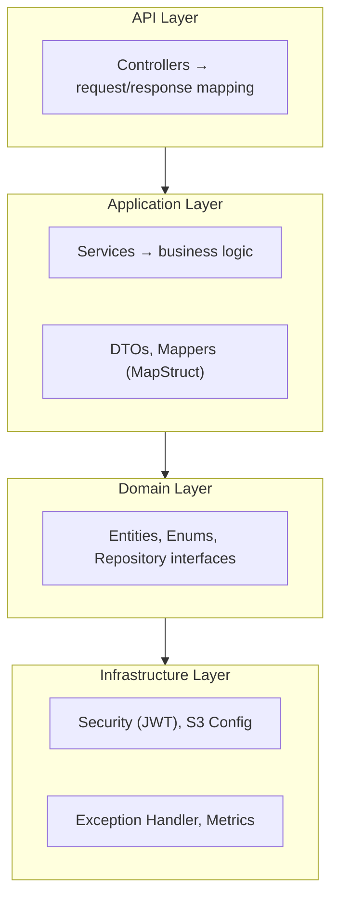
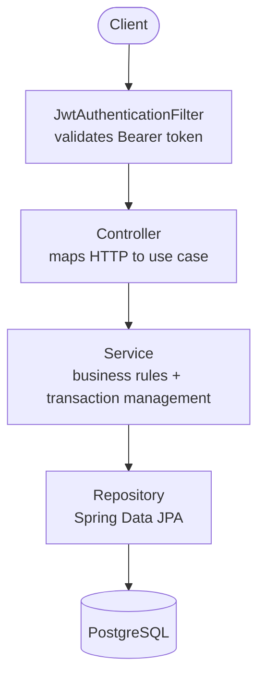
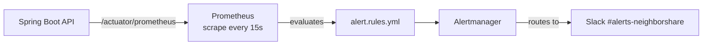
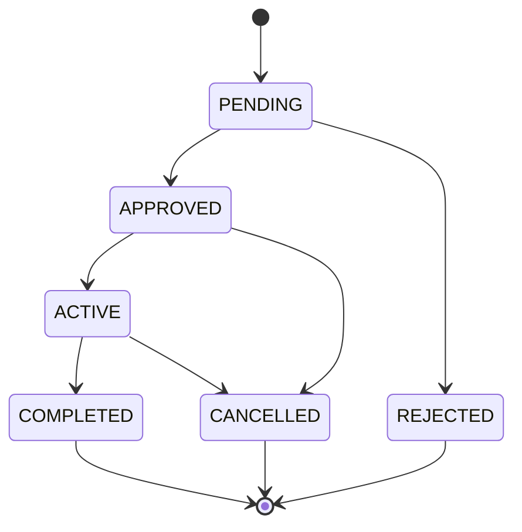

<div align="center">

# NeighborShare API

**A local circular economy platform for neighbors to share items within trusted communities.**


</div>

---

## Table of Contents

- [About the Project](#about-the-project)
- [Features](#features)
- [Architecture](#architecture)
- [Tech Stack](#tech-stack)
- [Getting Started](#getting-started)
  - [Prerequisites](#prerequisites)
  - [Environment Variables](#environment-variables)
  - [Running Locally](#running-locally)
- [API Reference](#api-reference)
- [Security](#security)
- [Observability](#observability)
- [Project Structure](#project-structure)
- [Roadmap](#roadmap)

---

## About the Project

NeighborShare is a RESTful backend for a **local circular economy platform** that allows neighbors to share tools, appliances, and other items within closed communities. Users create or join communities through invite codes, list items for loan, and manage reservations — all within a secure and observable environment.

The project is built with a focus on **production-readiness**: layered architecture, stateless JWT authentication, conflict-safe reservations using serializable transactions, presigned S3 uploads, structured error responses (RFC 7807), and a full observability stack with Prometheus and Alertmanager.

---

## Features

- **Community Management** — Create communities with auto-generated invite codes; join by code; promote/demote members; transfer admin rights.
- **Item Catalog** — Register items with condition grading, loan rules, and photos; filter by availability status.
- **Conflict-Safe Reservations** — Overlap detection with `SERIALIZABLE` transaction isolation to prevent double-booking under concurrent requests.
- **Reputation System** — Users start with a score of `5.0` that evolves through post-loan reviews.
- **Presigned S3 Uploads** — Clients upload photos directly to S3/LocalStack; the API never handles binary data.
- **Soft Delete** — Entities are never physically removed; all queries use `@SQLRestriction("deleted = false")`.
- **Structured Errors** — All error responses follow [RFC 7807 Problem Detail](https://www.rfc-editor.org/rfc/rfc7807), including field-level validation messages.
- **Observability** — HTTP metrics with percentile histograms, custom business metrics, Prometheus alerting rules, and Alertmanager routing with Slack integration.

---

## Architecture

The project follows a **layered architecture** with clear separation of concerns:



### Request Lifecycle



### Observability Stack



---

## Tech Stack

| Category | Technology |
|---|---|
| Language | Java 21 |
| Framework | Spring Boot 3.3.5 |
| Security | Spring Security + JJWT 0.12.6 |
| Database | PostgreSQL 16 |
| ORM | Spring Data JPA / Hibernate |
| Cache | Caffeine (in-process) |
| Mapping | MapStruct 1.5.5 |
| File Storage | AWS S3 SDK v2 (LocalStack in dev) |
| Documentation | SpringDoc OpenAPI 3 / Swagger UI |
| Monitoring | Micrometer + Prometheus |
| Alerting | Alertmanager + Slack |
| Testing | JUnit 5, Testcontainers (PostgreSQL), H2 |
| Build | Maven 3 |

---

## Getting Started

### Prerequisites

| Tool | Version |
|---|---|
| Java | 21+ |
| Maven | 3.9+ |
| Docker | 24+ (for PostgreSQL and LocalStack) |
| PostgreSQL | 16 (or via Docker) |

### Environment Variables

The application uses **three Spring profiles** (`dev`, `test`, `prod`). The active profile is controlled by the `SPRING_PROFILES_ACTIVE` environment variable.

#### `dev` profile (default)

| Variable | Default | Description |
|---|---|---|
| `SPRING_PROFILES_ACTIVE` | `dev` | Active Spring profile |
| `DB_URL` | `jdbc:postgresql://localhost:5432/neighborshare_dev` | JDBC connection URL |
| `DB_USER` | `db_user` | Database username |
| `DB_PASSWORD` | `db_password` | Database password |
| `JWT_SECRET` | *(dev default — change in prod)* | HMAC-SHA secret (min. 32 chars) |
| `JWT_EXPIRATION` | `86400000` | Access token TTL in ms (24h) |
| `JWT_REFRESH_EXPIRATION` | `604800000` | Refresh token TTL in ms (7d) |
| `AWS_S3_BUCKET` | `neighborshare-items-bucket` | S3 bucket name |
| `AWS_REGION` | `us-east-1` | AWS region |
| `AWS_ACCESS_KEY_ID` | `test` | AWS access key (LocalStack) |
| `AWS_SECRET_ACCESS_KEY` | `test` | AWS secret key (LocalStack) |
| `AWS_S3_ENDPOINT` | `http://localhost:4566` | Custom S3 endpoint (LocalStack) |

> **Production (`prod` profile):** All variables are **required** and have no defaults. `ddl-auto` is set to `validate` — schema changes must be managed via migrations (e.g., Flyway/Liquibase).

### Running Locally

**1. Start dependencies with Docker**

```bash
# PostgreSQL
docker run -d \
  --name neighborshare-postgres \
  -e POSTGRES_DB=neighborshare_dev \
  -e POSTGRES_USER=db_user \
  -e POSTGRES_PASSWORD=db_password \
  -p 5432:5432 \
  postgres:16-alpine

# LocalStack (S3 emulation)
docker run -d \
  --name neighborshare-localstack \
  -e SERVICES=s3 \
  -p 4566:4566 \
  localstack/localstack
```

**2. Create the S3 bucket in LocalStack**

```bash
aws --endpoint-url=http://localhost:4566 s3 mb s3://neighborshare-items-bucket
```

**3. Build and run the application**

```bash
# Clone the repository
git clone https://github.com/alexanderbs3/neighborshare.git
cd neighborshare

# Build (skipping tests)
./mvnw clean package -DskipTests

# Run (dev profile is active by default)
java -jar target/neighborshare-1.0.0.jar
```

**4. Verify the API is up**

```bash
curl http://localhost:8080/actuator/health
# {"status":"UP", ...}
```

**5. Access Swagger UI**

```
http://localhost:8080/swagger-ui.html
```

#### Running tests

```bash
# Unit + integration tests (uses H2 in-memory, test profile)
./mvnw test
```

> Tests use **Testcontainers** for PostgreSQL integration tests and **H2** (PostgreSQL mode) for lighter unit tests. Docker must be running.

---

## API Reference

All endpoints except `/api/v1/auth/**`, `/swagger-ui/**`, `/v3/api-docs/**`, `/actuator/health`, and `/actuator/info` require a `Bearer` token in the `Authorization` header.

### Auth

| Method | Endpoint | Description | Auth |
|---|---|---|---|
| `POST` | `/api/v1/auth/register` | Register a new user | Public |
| `POST` | `/api/v1/auth/login` | Authenticate and receive JWT | Public |

**Register request body:**
```json
{
  "name": "Alexander Brasiliano",
  "email": "alexander@example.com",
  "password": "senha123"
}
```

**Login / Register response:**
```json
{
  "accessToken": "eyJhbGci...",
  "refreshToken": "eyJhbGci...",
  "expiresIn": 86400
}
```

---

### Communities

| Method | Endpoint | Description |
|---|---|---|
| `POST` | `/api/v1/communities` | Create a community (caller becomes `COMMUNITY_ADMIN`) |
| `POST` | `/api/v1/communities/join?inviteCode=` | Join a community by invite code |
| `GET` | `/api/v1/communities/{communityId}` | Get community details |
| `GET` | `/api/v1/communities/my` | List my communities (pageable) |
| `DELETE` | `/api/v1/communities/{communityId}/leave` | Leave a community |

**Create community request body:**
```json
{
  "name": "Vizinhos do Pituba",
  "description": "Comunidade para compartilhar itens no bairro Pituba"
}
```

---

### Community Members

> These endpoints require `COMMUNITY_ADMIN` role for mutating actions.

| Method | Endpoint | Description |
|---|---|---|
| `GET` | `/api/v1/communities/{communityId}/members` | List members (pageable) |
| `PATCH` | `/api/v1/communities/{communityId}/members/{memberId}/role` | Update member role |
| `DELETE` | `/api/v1/communities/{communityId}/members/{memberId}` | Remove a member |

**Update role request body:**
```json
{
  "role": "COMMUNITY_ADMIN"
}
```

Available roles: `COMMUNITY_ADMIN` | `MEMBER`

---

### Items

| Method | Endpoint | Description |
|---|---|---|
| `POST` | `/api/v1/items` | Register a new item |
| `GET` | `/api/v1/items/community/{communityId}?status=AVAILABLE` | List community items by status (pageable) |

**Create item request body:**
```json
{
  "name": "Furadeira Bosch GSB 13",
  "category": "Ferramentas",
  "condition": "GOOD",
  "communityId": "{{communityId}}",
  "loanRules": "Devolver em até 3 dias.",
  "photoUrls": ["https://bucket.s3.amazonaws.com/key.jpg"]
}
```

**Item conditions:** `NEW` | `GOOD` | `FAIR`

**Item status (filter):** `AVAILABLE` | `RESERVED` | `BORROWED` | `UNAVAILABLE`

---

### Reservations & Reviews

| Method | Endpoint | Description |
|---|---|---|
| `POST` | `/api/v1/reservations/reviews` | Submit a review for a completed reservation |

**Create review request body:**
```json
{
  "reservationId": "{{reservationId}}",
  "rating": 5,
  "comment": "Item devolvido antes do prazo e em ótimas condições."
}
```

`rating` must be an integer between `1` and `5`.

**Reservation lifecycle:**


<!-- Nota: a transição para CANCELLED foi assumida como possível a partir de APPROVED/ACTIVE
     (antes da conclusão do empréstimo). Ajuste conforme a regra real implementada em ReservationService. -->

---

### Media & Storage

| Method | Endpoint | Description |
|---|---|---|
| `POST` | `/api/v1/media/presigned-url?filename=&contentType=` | Generate a presigned S3 upload URL (valid for 15 min) |

**Upload flow:**
1. Call this endpoint to receive `uploadUrl` and `fileKey`.
2. `PUT` the file binary directly to `uploadUrl` with the matching `Content-Type` header.
3. Include `fileKey` (or the public URL) in the `photoUrls` array when creating an item.

---

### Error Responses

All errors follow [RFC 7807 Problem Detail](https://www.rfc-editor.org/rfc/rfc7807):

```json
{
  "type": "https://neighborshare.com/errors/business-conflict",
  "title": "Regra de Negócio Violada",
  "status": 409,
  "detail": "Já existe uma reserva aprovada ou ativa para este período.",
  "timestamp": "2025-04-18T14:30:00Z"
}
```

| HTTP Status | Scenario |
|---|---|
| `400` | Validation errors (includes `invalidFields` map) |
| `401` | Missing or invalid JWT |
| `403` | Insufficient permissions |
| `404` | Resource not found |
| `409` | Business rule violation (e.g., double-booking, already a member) |

---

## Security

- **Authentication:** Stateless JWT (no server-side sessions). Tokens are validated on every request by `JwtAuthenticationFilter`.
- **Authorization:** `@EnableMethodSecurity` with `@PreAuthorize` at the service layer. The `/actuator/prometheus` endpoint requires `ROLE_ADMIN`.
- **Passwords:** Hashed with BCrypt.
- **Token lifetime:** Access token = **24h** · Refresh token = **7d** (configurable via environment variables).
- **Soft Delete:** Deleted users are locked out via `UserDetails` methods that check the `deleted` flag.

---

## Observability

### Actuator Endpoints

| Endpoint | Access | Description |
|---|---|---|
| `GET /actuator/health` | Public | Liveness and readiness probes |
| `GET /actuator/info` | Public | Application info |
| `GET /actuator/prometheus` | `ROLE_ADMIN` | Prometheus metrics scrape |

### Prometheus Metrics

HTTP metrics are exported with **percentile histograms** (P50, P95, P99) via Micrometer:

```yaml
metrics:
  distribution:
    percentiles-histogram:
      http.server.requests: true
```

**Custom business metrics** defined in `BusinessMetrics.java`:

| Metric | Type | Description |
|---|---|---|
| `neighborshare_reservations_created_total` | Counter | Total reservations requested |
| `neighborshare_reservation_processing_time_seconds` | Timer | Reservation business logic duration |

### Alerting Rules (`alert.rules.yml`)

| Alert | Condition | Severity |
|---|---|---|
| `NeighborShareApiDown` | Instance unreachable for > 1 min | 🔴 Critical |
| `HighHttp5xxRate` | 5xx error rate > 5% for 2 min | 🔴 Critical |
| `HighHttpLatencyP95` | P95 latency > 1.5s for 3 min | 🟡 Warning |
| `HikariConnectionPoolExhausted` | Threads waiting for DB connections | 🔴 Critical |

### Alert Inhibition (`alertmanager.yml`)

Inhibition rules prevent alert storms from a single root cause:
- **PostgreSQL down** → silences 5xx, HikariCP, and latency alerts.
- **API down** → silences all internal HTTP and metric alerts.
- **Critical active** → silences warning-level alerts for the same service.

Notifications are routed to `#alerts-neighborshare` on Slack via webhook.

---

## Project Structure

```
src/
├── main/
│   ├── java/br/leetjourney/neighborshare/
│   │   │
│   │   ├── api/controller/             # HTTP layer — request/response mapping
│   │   │   ├── AuthController.java
│   │   │   ├── CommunityController.java
│   │   │   ├── CommunityMemberController.java
│   │   │   ├── ItemController.java
│   │   │   ├── MediaController.java
│   │   │   └── ReservationController.java
│   │   │
│   │   ├── application/
│   │   │   ├── dto/
│   │   │   │   ├── request/            # Inbound DTOs with Bean Validation
│   │   │   │   └── response/           # Outbound DTOs
│   │   │   ├── mapper/                 # MapStruct mappers (compile-time generated)
│   │   │   └── service/               # Business logic + transaction boundaries
│   │   │       ├── AuthService.java
│   │   │       ├── CommunityService.java
│   │   │       ├── CommunityMemberService.java
│   │   │       ├── FileStorageService.java
│   │   │       ├── ItemService.java
│   │   │       ├── ReservationService.java
│   │   │       └── ReviewService.java
│   │   │
│   │   ├── domain/
│   │   │   ├── enums/                  # GlobalRole, CommunityRole, ItemCondition,
│   │   │   │                           #   ItemStatus, ReservationStatus
│   │   │   ├── model/                  # JPA entities (soft-delete via @SQLRestriction)
│   │   │   │   ├── BaseEntity.java     # id (UUID), createdAt, updatedAt, deleted
│   │   │   │   ├── User.java
│   │   │   │   ├── Community.java
│   │   │   │   ├── CommunityMember.java
│   │   │   │   ├── Item.java
│   │   │   │   ├── Reservation.java
│   │   │   │   └── Review.java
│   │   │   └── repository/             # Spring Data JPA interfaces
│   │   │
│   │   └── infrastructure/
│   │       ├── config/S3Config.java    # S3Client + S3Presigner beans
│   │       ├── exception/              # GlobalExceptionHandler (RFC 7807)
│   │       ├── metrics/                # BusinessMetrics (Counter + Timer)
│   │       └── security/               # JwtService, JwtAuthenticationFilter,
│   │                                   #   SecurityConfig, UserDetailsServiceConfig
│   │
│   └── resources/
│       ├── application.yml             # Multi-profile config (dev / test / prod)
│       └── prometheus/prometheus.yml   # Prometheus scrape + alert config
│
├── rules/
│   ├── alert.rules.yml                 # Prometheus alerting rules
│   └── alertmanager.yml                # Alertmanager routing + inhibition + Slack
│
└── test/                               # JUnit 5 + Testcontainers + H2
```

---

## Roadmap

Features already implemented at the service layer but not yet exposed via REST:

- [ ] `POST /api/v1/reservations` — Create a reservation (service + overlap-detection logic implemented with `SERIALIZABLE` isolation; missing controller endpoint and request DTO)
- [ ] `PATCH /api/v1/reservations/{id}/status` — Approve / reject / cancel a reservation (owner action)
- [ ] `GET /api/v1/items/{itemId}` — Get a single item by ID
- [ ] `PATCH /api/v1/items/{itemId}` — Edit item details or status
- [ ] `GET /api/v1/users/me` — Get authenticated user profile and reputation score
- [ ] `docker-compose.yml` — Orchestrate API + PostgreSQL + LocalStack + Prometheus + Alertmanager
- [ ] Database migrations — Replace `ddl-auto: update` with Flyway or Liquibase
- [ ] Refresh token endpoint — `POST /api/v1/auth/refresh`
- [ ] `GET /api/v1/reservations` — List reservations by item or user

---

<div align="center">

Built with ☕ and Spring Boot by [Alexander Brasiliano](https://github.com/alexanderbs3)

</div>